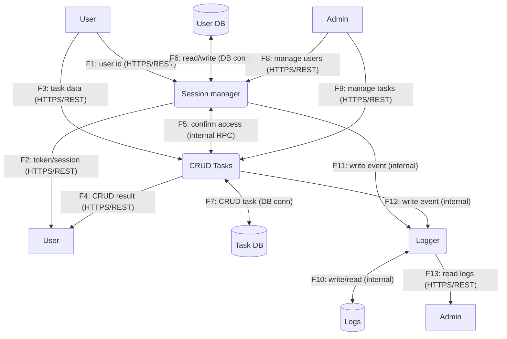

## Диаграмма потоков данных (DFD)

Ниже представлена DFD модели системы в двух уровнях детализации: контекстная (Level 0) и декомпозиция ключевых процессов (Level 1). Диаграммы оформлены в формате Mermaid для удобного рендеринга.

### Допущения
- Система — веб‑сервис с REST API, включающий процессы `Session manager` (аутентификация/сессии) и `CRUD Tasks` (операции с задачами).
- Внешние сущности: `User` и `Admin` (администратор — привилегированный пользователь).
- Хранилища: `User DB` (учетные записи, статусы, атрибуты доступа), `Task DB` (данные задач), `Logs` (аудит и операционные логи), доступ к ним идет через процессы.
- Подсистема логирования представлена процессом `Logger`, который пишет/читает в/из `Logs`.
- Используются токены/сессии; проверка доступа для операций с задачами выполняется через `Session manager`.

### Условные обозначения
- Внешние сущности: прямоугольники
- Процессы: скругленные прямоугольники
- Хранилища данных: цилиндры
- Потоки данных: направленные стрелки
 - Границы доверия: цветовые классы узлов (client/edge/core/data)

### Описание потоков данных
- F1: User → Session manager — передача идентификатора/учетных данных для аутентификации.
- F2: Session manager → User — возврат токена/сессии.
- F3: User → CRUD Tasks — данные для операций с задачами (CRUD).
- F4: CRUD Tasks → User — результат операции CRUD.
- F5: CRUD Tasks → Session manager — подтверждение прав доступа.
- F6: Session manager ↔ User DB — чтение/запись учетных записей.
- F7: CRUD Tasks ↔ Task DB — операции CRUD над задачами и результат.
- F8: Admin → Session manager — управление пользователями.
- F9: Admin → CRUD Tasks — управление задачами.
- F10: Logger ↔ Logs — запись/чтение аудита и операционных логов.
- F11: Session manager → Logger — запись событий аутентификации/доступа.
- F12: CRUD Tasks → Logger — запись событий операций над задачами.
- F13: Logger → Admin — предоставление логов для чтения.

### Границы доверия (client/edge/core/data)
- Client: `User`, `Admin` (включая отображение ответов пользователю).
- Core: `Session manager`, `CRUD Tasks`, `Logger` (приложение и сервисы выполнения логики).
- Data: `User DB`, `Task DB`, `Logs` (персистентные хранилища, без прямого внешнего доступа).
- Edge: сеть/HTTP(S) граница между Client и Core (все потоки F1, F2, F3, F4, F8, F9, F13 проходят через защищенный канал HTTPS).

### Протоколы/каналы
- HTTPS/REST: F1, F2, F3, F4, F8, F9, F13
- Внутренний RPC/IPC: F5, F11, F12
- Подключение к БД (TCP/протокол СУБД): F6, F7, F8
- Доступ к журналам (локальная/централизованная система логов): F10

### Границы и безопасность
- Все внешние запросы к данным задач проходят проверку прав через `Session manager` (роль‑базированная авторизация на основе токена/сессии).
- Прямого доступа к `User DB`, `Task DB` и `Logs` нет; доступ осуществляется только через `Session manager`, `CRUD Tasks` и `Logger` соответственно (минимизация привилегий).
- Полный аудиторский след обеспечивается записью действий в `Logs`; чтение логов доступно только уполномоченным субъектам (например, `Admin`).
- Токены/сессии имеют сроки жизни; при каждом критичном действии выполняется серверная валидация токена и прав.
